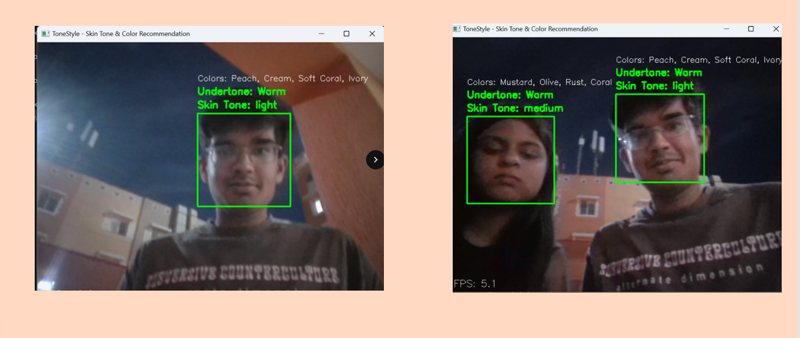
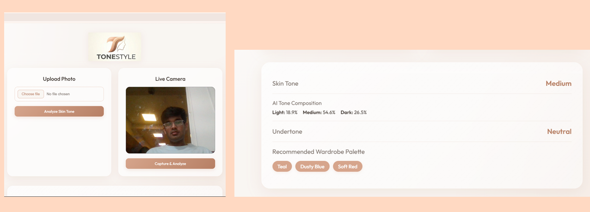

<div align="center">

# 🎨 ToneStyle 
### Real-time Skin Tone Detection & Personalized Color Recommendation System


*Choosing the right colors for your skin tone — solved with AI.*

</div>

---

## 🧠 About the Project

ToneStyle is a real-time AI-powered application that uses your webcam to detect skin tone and undertone, then recommends personalized colors based on color theory — no manual input needed.

It combines **Computer Vision**, **Deep Learning (CNN)**, and **Machine Learning (Ensemble)** to analyze facial skin live and suggest shades that genuinely complement your complexion.

---

## 📸 Demo

<div align="center">

### 🌐 Web App

<p><em>Live camera analysis showing skin tone (Medium), undertone (Warm) and recommended wardrobe palette</em></p>

<br/>

### 🎥 Real-Time Webcam Detection

<p><em>Multi-face detection with individual skin tone & undertone classification at real-time FPS</em></p>

</div>

---

## ✨ Key Features

- 🎥 Real-time webcam skin tone detection
- 🤖 CNN (MobileNetV2) for tone classification — Light / Medium / Dark
- 👤 Face detection via SSD (OpenCV DNN)
- 🌡️ Undertone analysis (Warm / Cool / Neutral) using LAB color space + ITA
- 📊 Multi-frame averaging for stable, smooth predictions
- 🗳️ Ensemble Voting Classifier (Scikit-learn) for ML-based classification
- 🎨 Personalized color recommendations based on tone + undertone
- ⚡ Optimized for real-time performance (low latency)

---

## ⚙️ How It Works

```
Webcam Input → Face Detection (SSD) → Preprocessing → CNN Skin Tone Prediction
      → RGB → LAB Conversion → Undertone Detection (a, b, ITA)
          → Multi-frame Smoothing → Color Recommendation
```

---

## 🛠️ Tech Stack

| Category | Tools |
|---|---|
| Language | Python |
| Deep Learning | TensorFlow / Keras, MobileNetV2 |
| Computer Vision | OpenCV (SSD DNN) |
| Machine Learning | Scikit-learn, Joblib |
| Data | NumPy, Pandas |

---

## 📁 Project Structure

```
TONE-STYLE/
│
├── src/              # Core ML logic
├── models/           # Trained models
├── data/             # Dataset
├── web_app/          # UI / Web interface
├── notebooks/        # Experiments
├── demo/             # Sample outputs
│
├── main.py           # Entry point
├── requirements.txt
├── README.md
└── .gitignore
```

---

## 🚀 Quick Start

```bash
# 1. Clone the repo
git clone https://github.com/ajiteshshuklaa/ToneStyle.git
cd ToneStyle

# 2. Install dependencies
pip install -r requirements.txt

# 3. Run the app
python main.py
```

> Press **Q** to exit the webcam window.

---

## 📊 Dataset

Custom experimental dataset (CSV) covering:
- Skin tone labels (Light / Medium / Dark)
- Undertone labels (Warm / Cool / Neutral)
- Color recommendation mappings

Used for validation, feature-based ML classification, and model testing.

---

## 🤖 Models Used

| Model | Purpose |
|---|---|
| MobileNetV2 (CNN) | Skin tone classification |
| SSD (OpenCV DNN) | Real-time face detection |
| Voting Classifier | Ensemble ML classification |


---

## 👩‍💻 Author

**Ajitesh Shukla** — AI & Computer Vision Enthusiast

[](https://github.com/ajiteshshuklaa)

---

## 📄 License

This project is licensed under the MIT License — see the [LICENSE](LICENSE) file for details.
